# Exercise 1: Delegation of Authority

## Introduction

When it comes to automating ERP workflows, nothing is more painful, or more time consuming than the approval cycle. Couple that with a rigid system like SAP, and it becomes difficult to track, let alone automate approvals on everyday transactions like Purchase Orders, Sales Orders, Invoices, etc. A common term for this process is Delegation of Authority (DoA), or an Approval Matrix.

Within SAP, [there is such a feature](https://help.sap.com/doc/132b1ea8da1d4281a2da23f3cf506809/2.0.06/en-US/07dc534035524965a902c5bd6ffdbc3a.html), but it is limited in capability and does not scale for exceptional workflows.


## Tales from the field

In one of our customer's internal landscape, they reported having 54 different workflows that covers multiple business objects, and their solution to that was over 12,000 lines of code in a custom .NET application for approvals and authority. Some of these workflows require 7 or more levels of approvals, and any changes to personnel or approval logic requires a major rewrite of the code, which they currently spend over 30 days a year doing. Approvers only have one desktop interface they can use to run these approvals. Obviously not scalable, and a terrible user experience! 


> The sample that we will work with, but it usually gets a lot more complicated than this ☠️

Thankfully, we have the solution for this, so let's start by showing how you can run these approval matrices on top of the Sales Order documents from SAP. 
<br><br>
For easy reference, this is how the Standard Order (Sales Order) document looks like in SAP ECC. You navigate to this module by entering the T code *VA01*. The T Code (Transaction code) is a 4 digit shortcut key to access a requested transaction, sort of like carrying out an *incident.list* command in the ServiceNow UI.


## Let's start

1. Under **All**, search and navigate to **App Engine Studio**

    

1. Click **Create app** on the top right of the screen

    

1. On the Create App page, name the app "Delegation of Authority", and for description, enter "Create an approval matrix for various SAP documents"

    

1. Click **Continue**

1. Leave the default roles - *admin* and *user*, and click **Continue**

1. Click **Go to app dashboard**

## Create a Sales Order table

We will now create a table to store Sales Order document data from SAP.

1. Under **Data**, click **Add**

    

1. Click **Create a table**

1. Click **Get started**

1. On the *Add Data* page, click **Create from an existing table**

1. On the next page, search and select **Task**

    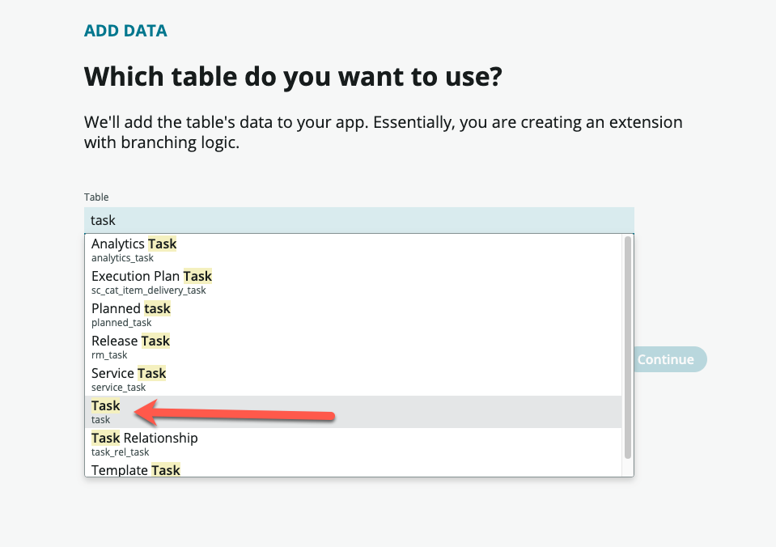

1. Click **Continue**

1. For Table label, enter **SAP Sales Order**. Table name should be auto-populated.

1. Check **Auto number**

1. For Prefix, enter **SAPSO**

    

1. Click **Continue**

1. Allow all access for *admin* and *user*, then click **Continue**

    

1. Click **Edit table**

1. If presented with the **GETTING STARTED** pop-up, close it.

1. You should now be on tha *Table Builder* interface. Click **Add new field**, and add the following fields:

    Column label | Type
    -------------- | --------------
    Document number | String
    Document type | String
    Amount | Decimal 
    Sales organization | String 
    Status | Choice (Dropdown with --None--) : New, Approval triggered, Approved, Rejected, Updated SAP

1. Your screen should look like this

    

1. Click **Save**

1. Click **Form views** on the top of the screen

    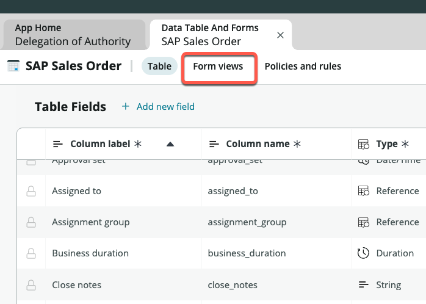

1. Click the **Default view** dropdown

1. Click **+ Create**

1. Enter **Sales order view**

    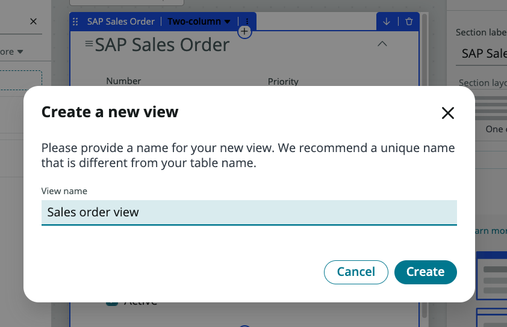

1. Click **Create**

1. Rename the section to **Sales Order** by clicking on the section and editing the **Section label** on the right panel

    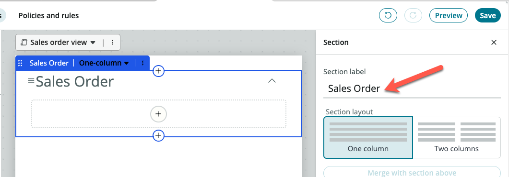

1. Drag the following fields onto the form:
    1. Number
    1. Status
    1. Document number
    1. Document type
    1. Amount
    1. Sales organization

    

1. Your completed view should look like this

    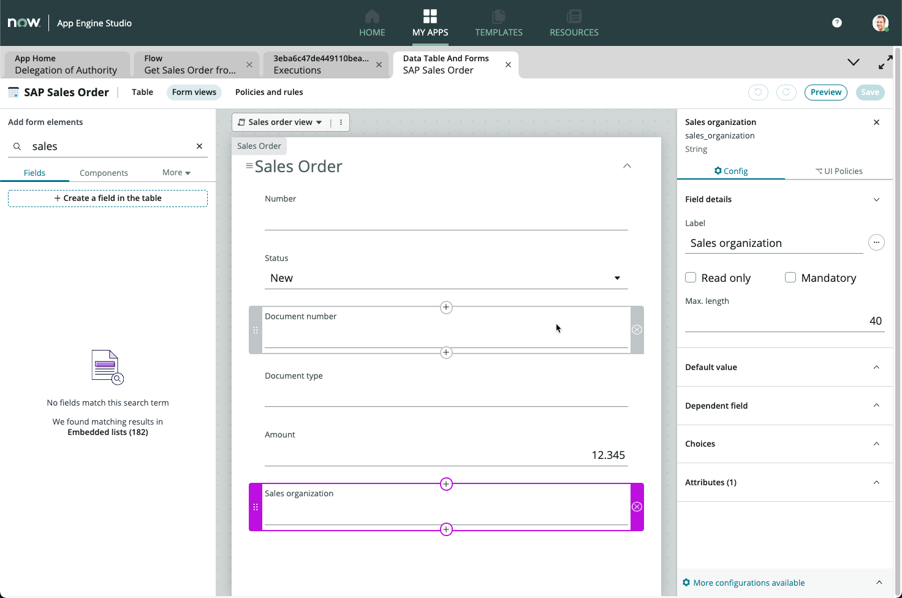

1. Click **Save**

Great, you now have a simple table to store Sales Order data via the SAP integration that we will be configuring next.

## Get Sales Order data via the SAP ERP Spoke

1. Go back to the app home page 

1. Under *Logic and Automation*, click **Add**

1. In the *What do you want to add* screen, click **Flow**

    

1. Click **Build from scratch**

1. Under **Name**, enter "Get Sales Orders from SAP every 2 hours"

1. Click **Continue**

1. Click **Edit this flow** once you see the *Success! Your flow is ready.* screen

1. Close the pop-up box

1. Click **Add trigger**

1. Under the *Date* section, click **Repeat**

1. Change the repeat duration to 2 hours

    

1. Click **Add an Action, Flow Logic, or Subflow**

1. Click **Action**, and you should see a dropdown appear

1. In the *Search* bar, enter **SAP**

    

> You should be able to see a few different SAP spokes show up. There are 2 different out of the box integration methods to both SAP ECC (Older version) and SAP S/4 HANA. These integration spokes are available in the Enterprise package of Automation Engine. 
<br> <br>
Let's break down the available spokes and when to use them: 
<br><br>
**SAP ECC**: Most of the companies using SAP are running on SAP ECC. It is the offering for a large enterprise. Companies with large volume, complex business processes and operating in multiple geographies go for SAP ECC. It is built on ABAP stack. 
<br><br>
**SAP S/4 HANA**: This is the latest release of SAP ERP and it can run only on HANA database. With this release, SAP has simplified their core database architecture. This together with in-memory processing enables business to do complex business computation faster than ECC.
<br><br>
**Integration via IDoc**: IDOCs or intermediary documents are another way to exchange information to and from SAP. If you are more aware of web technologies, consider IDOCs as XML. It consists of neatly defined data segments with parent and child nodes. There are specific steps to configure inbound and outbound IDOCs.
<br><br>
**Integration via RFC**: If you are looking at a real time SAP system integration scenario, RFC is probably the best way to go. In this case, certain functions are enabled for remote call. One such function could be, for example, sales order creation. Third party applications can integrate with SAP using these RFCs for a real time communication and business process validation (example price computation, minimum order check etc.).

15. Click **SAP ERP**, for this lab we will be using a custom spoke which simulates integration to SAP. This spoke includes only a few of the actions available in the OOTB spokes.

1. Click **Look up Sales Orders**

    

1. Have a look at the action that shows on the screen. These are a subset of the filter options available in the OOTB spokes to retrieve a list of Sales Orders. In this exercise, we will only return one Sales Order record for easier accesibility.

    

1. Notice how the **Delivery Block** field is populated with **ServiceNow approval**. Delivery block when applied, blocks the sales order for delivery i.e., delivery cannot be created until the delivery block is removed by the authorized person. This list can be customised in SAP, and the logic would be that as Sales Orders are created in SAP, this Delivery Block status is automatically applied until the approval is completed in ServiceNow.

1. Leave everything as it is, and click **Done**

1. Click **Add an Action, Flow Logic, or Subflow** and add another action

1. Under **ServiceNow Core**, click **Create Record**

    

1. On the table field, search and select **SAP Sales Order** (the custom table you created)

1. Click **Add field value**, select **Document number**

1. Drag the **Document number** data pill into the input field

1. Repeat the above 2 steps for **Amount, Document type** and **Sales organization**

    

1. Add one final field **Status** and set the value to **New**

1. Your entire action should look like this

    

1. Click **Save** on the top right of the screen.

1. Click **Test**

1. Click **Run Test**

1. Click **Your test has finished running. View the flow execution details.**

    

1. In the new tab that opens, click the **Create Record** action

1. Click the Record, if you followed the guide so far, the record should be **SAPSO0001001**

    

1. In the pop-up box, click **Open Record**, it should open in a new browser tab.

1. Click on the Hamburger icon on the top left, and under **View**, select **Sales order view**

1. Ensure that all the fields are populated. (Your output will be different)

    

1. Click on the Hamburger icon again

1. Under **Configure**, click **Related Lists**

1. Search for **Approvers**, and shift that into the **Selected** column

    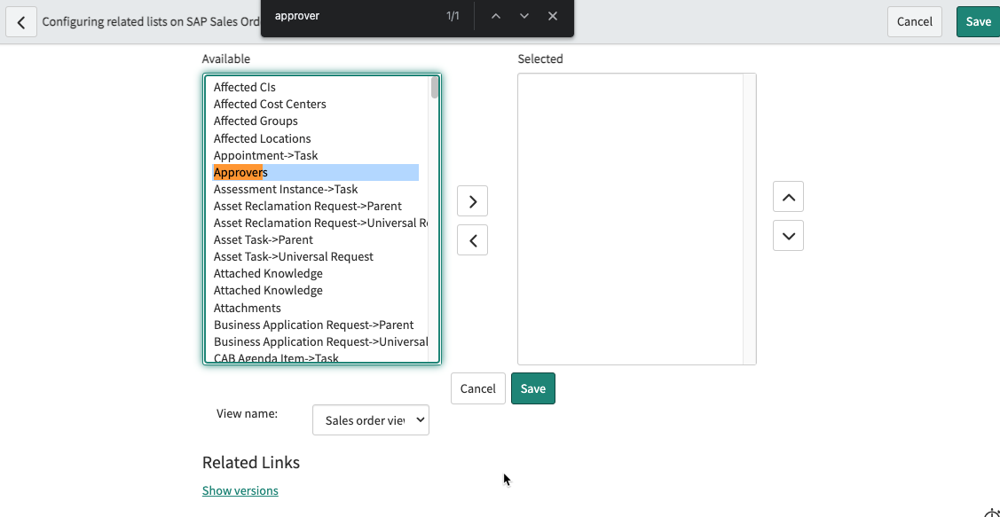

1. Click **Save**

Congrats! You have built the table to store Sales Order data from SAP. Any approvals that you trigger later can also be seen on this view. Go back to the previous browser tab, but don't close anything yet.

## Building the approval matrix using decision builder

For this part of the exercise, we will rebuild this following approval matrix


1. Go back to the **App Home** tab

1. Under *Logic and automation*, click **Add**

1. Click **Decision**

    

1. Click **Get started**

1. Under Name, enter **Sales Order Approval Matrix**

    
    > If you face an issue with the Continue button not turning blue, you might have to close this screen and click Decision again

6. Click **Continue**

1. Click **Edit decision table**

1. Click **Add an input**

1. Under label, enter **Sales order record**

1. Under type, select **Reference**, and under Table, search and select **SAP Sales Order**

    

1. Click **Save** on the top right

1. Click **Add result column**

    

1. Under Result column label, enter **Approval group**

1. Click **Result type**, then select **Reference**

1. Under **Result table**, search **Group** and select **sys_user_group**

1. Click **Done**

1. Under the **Approval group** column, add these selections as per our matrix at the start of this section: Finance managers, Finance controllers, CFO, CFO (Ensure that CFO is created twice as we have two different scenarios that require CFO approval)

    
    
1. Now we have the results, we need to add the conditions.

1. Click **Add condition column**

1. In the pop-up, select the fields as per the image below

    

1. Click **Done**

1. Click on the **Plus sign** in between the 2 columns

    

1. Click **Add condition column**

1. Fill in the pop-up modal as per the image below

    

1. Click **Done**

1. Click in the first cell under **Sales order amount**, select **less than**, and Value **5000**

    

1. In the corresponding cell for **Sales order type**, select **is**, and Value **Standard sales order**

    

1. See if you can fill in the rest according to the matrix below (You have just completed the first row)

    

29. Your screen should look like the following once complete

    

30. Click **Save** on the top right

## Using approval decision matrix in a flow

1. Navigate back to **App Home**

1. Under *Logic and automation*, click **Add**

1. Click **Flow**

1. Click **Build from scratch**

1. Under **Name**, type **Sales Order Approval Flow**, then click **Continue**

1. Click **Edit this flow**

1. Click on **Add a trigger**, and under *Record*, select **Created**

1. Under *Table*, search and select **SAP Sales Order**

    

1. Click **Done**

1. Click **Add an Action, Flow Logic, or Subflow**

1. Click **Action**, then select **Update Record** under **ServiceNow Core**

    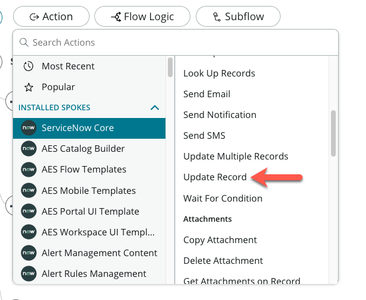

1. Drag the **SAP Sales Order Record** from **Trigger - Record Created** within the data column on the right, onto the **Record** field

1. Click **Add field value**

1. Set field to **Status** and select **Approval triggered**

    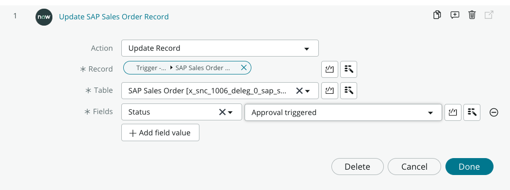

1. Click **Done**

1. Click **Add an Action, Flow Logic, or Subflow**

1. Click **Flow Logic**, then **Make a decision**

1. Under **Decision Label**, type **SO Approval Matrix**

1. Under **Decision Table**, search for the decision table we just created, **Sales Order Approval Matrix**

1. Drag in the **SAP Sales Order Record** data pill from **Trigger - Record Created** within the data column on the right, onto **Sales order record**

    

1. Click **Done**

1. You should now see three branches appear for each *Group* we selected as approvers earlier

    > **IMPORTANT** For this lab, we will not spend time building out the complete approval workflow for each branch. The idea here is that you now have the ability to cater to any specific workflow approval pattern using the ServiceNow Core *Ask for Approval* action.

23. Click on **+** under the first branch

1. Click **Action**

1. Search for **Ask For Approval**, then select the action

    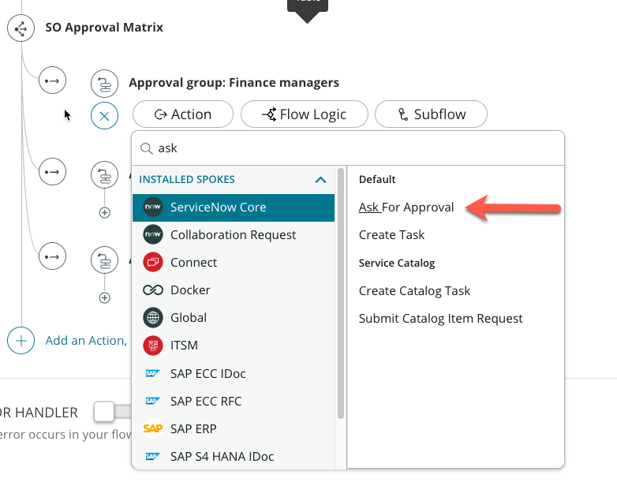

1. Drag **SAP Sales Order Record** from **Trigger - Record Created** within the data column on the right, onto the **Record** field

1. Since we extended the **Task** table, the **Approval Field** and **Journal Field** should be automatically populated

1. Under rules, change **-Choose approval rule** to **Anyone approves** (We are not factoring an Rejection flow here)

1. Drag over **Approval group** reference from **2 - Make a decision > Result Record** onto the empty field

    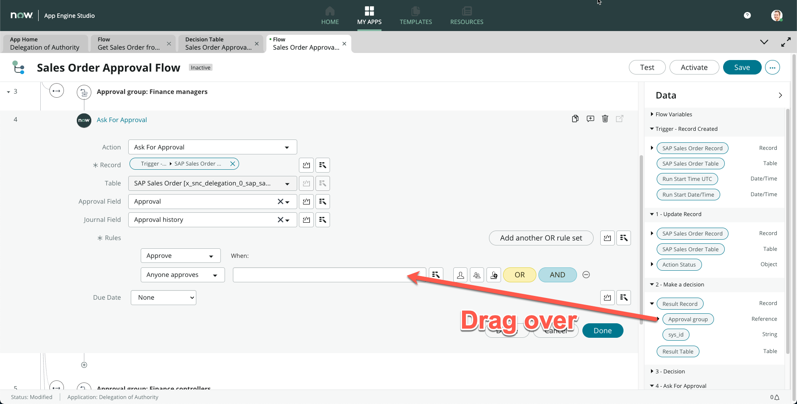

1. Click **Done**

1. On the **Ask For Approval** action you just added, click on the **Duplicate** icon twice

1. Drag each of the 2 duplicated actions under each of the other branches

    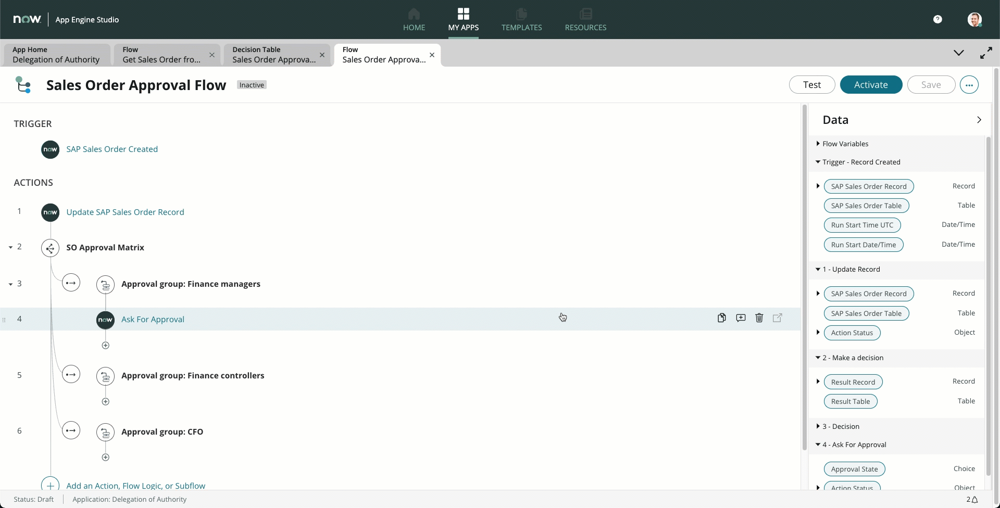

1. Outside of the Decision flow, click **Add an Action, Flow Logic, or Subflow**

1. Click **Action**

1. Search for **SAP ERP**, then select **Update Sales Order**

    

20. Under the **Sales Document** field, drag the **Document number** pill from **Trigger - Record Created > SAP Sales Order Record** within the data column on the right, onto the field

21. Change the **Delivery Block** field to **None**

    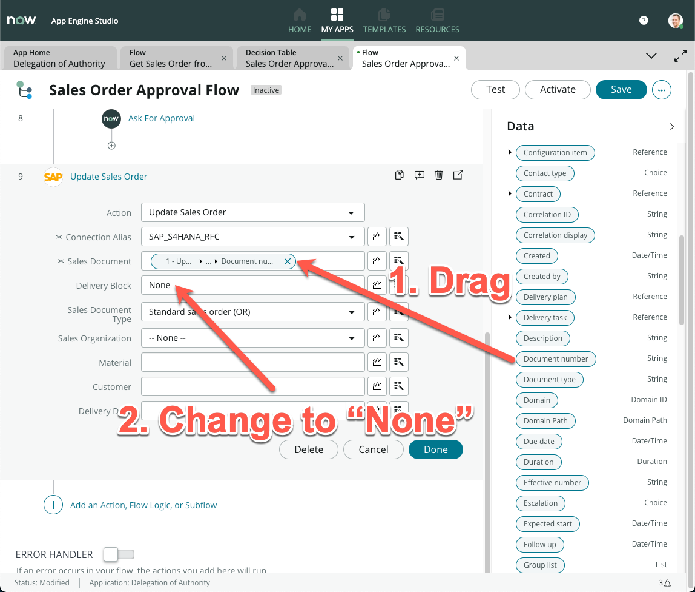

1. Click **Done**

> For reference, this action will remove the delivery block as you see in the image from SAP ECC below, which will allow the order to move to the next stage, which is generally creating a delivery document. 


39. Under the *Update Sales Order* action, add a new **Action**

1. Select **Update Record** under **ServiceNow Core**

1. Drag the **SAP Sales Order Record** pill from **Trigger - Record Created** within the data column on the right, onto the **Record** field

1. Add a field, select **Status** and select **Updated SAP**

    

1. Click **Done**

1. Your entire flow should now look like this

    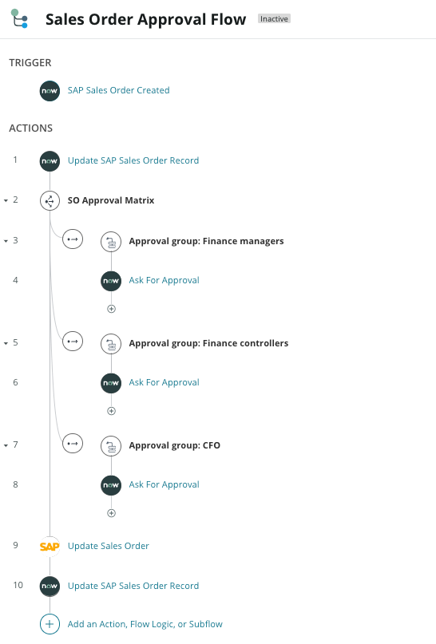

1. Click **Activate** on the top right

1. Click **Test**, and select the record that was created via the first flow we created, it should be **SAPSO0001001**

    

1. Click **Your test has finished running. View the flow execution details**

1. Check the execution flow, did it match our Approval Matrix? Your results will vary based on your record and should now be in Waiting for approval state after identifying the right approval group

    

1. If it did not, examine your Decision Builder table again to see if there was anything you missed.

1. Open up the Sales Order record tab (SAPSO0001001)

1. **Refresh** the page

1. Confirm that the **Status** has changed to **Approval triggered**

1. Right click on any **Requested** approval records, and click **Approve**

    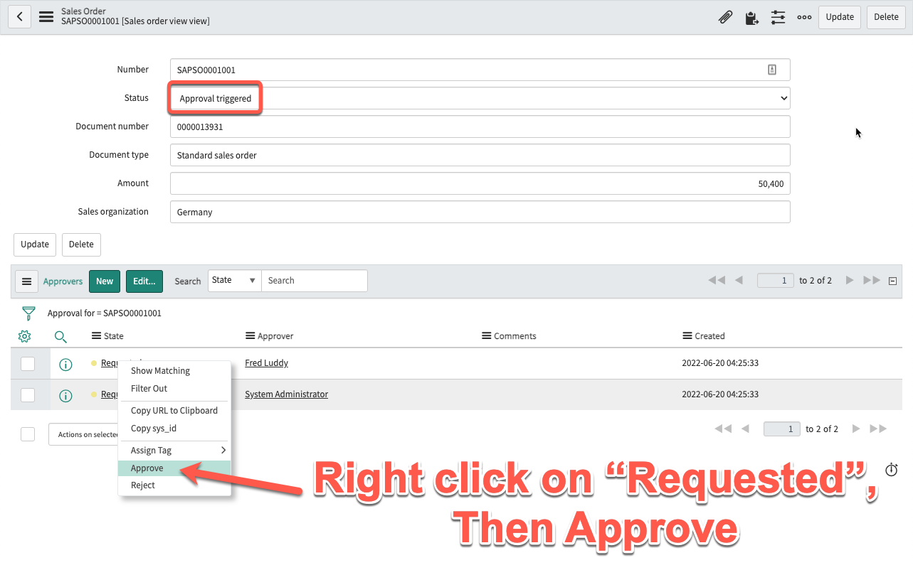

1. Return to the flow execution screen and click the **Refresh** icon

    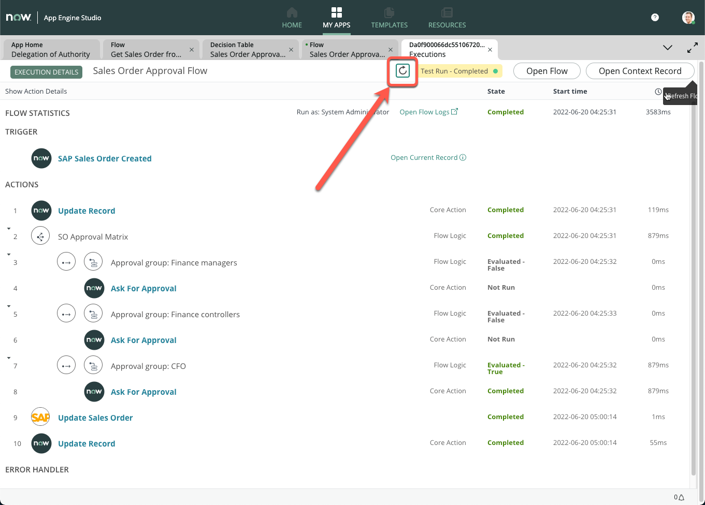

1. Your flow should now be completed and the record updated

As you can imagine, now that we have these 2 workflows designed, one will essentially trigger off the other: Our custom app will pull Sales Orders from SAP every 2 hours, and for any new Sales Orders picked up, it will be processed via our Decision Table, before routing to the right parties for Approval. Only after approval, will we then update the same Sales Order back in SAP (to remove the delivery block).

Well done! You've come to the end of Exercise 1, where you've built a very powerful approval matrix alternative that sits on top of any SAP document to drive the Delegation of Authority process. We've gone from 12,000 lines of code to 0 and modifying this workflow to include new decisions will take minutes, not days.

Of course, this is only the very start, and you can start to include platform capabilties such as SLAs, Approval Delegation periods, Conversational integrations, Mobile Approvals and more that makes the entire process seamless.

# Exercise 2: Automating Financial Close - The Journal Entry experience

## Introduction

The financial close is a critical process that happens regularly (Monthly, Quarterly, Yearly) in a business with the general goal of producing financial reports representative of the company's true financial position. This is a stressful exercise and there is typically a checklist of activities that the finance team has to undertake, for example: 
- Perform inventory count
- Reoncile account and post Journal Entries
- Update cash flow statements
- Balance petty cash funds, any many more.

Many of these activities also tie back to SAP as the system of record, but these activities are essentially workflows, not just record transactions! These activities have a start, an end and lifecycle events inbetween. Navigating across SAP, updating, checking then reporting becomes a huge headache. In fact, in a 2021 SAPinsider report, 58% of organizations see financial close as the biggest pain point for financial processing. Only 30% of organizations have implemented solutions to automate the SAP financial close process, far below areas such as Account Receivable or Accounts Payable. So can we make this better? Obviously!

In this exercise, let's focus on one of the key activites, which is Journal Entry posting from ServiceNow to SAP.

> A journal entry is used to record a financial transaction in the accounting records of a business. A journal entry is usually recorded in the general ledger, which is then used to create financial statements for the business. The logic behind a journal entry is to record every business transaction in at least two places (known as double entry accounting). <br> In the following diagram, you can se that posting journal entries in the general ledger is among the first tasks in the financial close process. Not only finance users, but sometimes business users as well, have to post hundreds or thousand of manual journal entries in each period! <br>


Since you've already gone through the excercise of creating a new app and tables and forms, the setup of these application files for this exercise is already done for you.

1. Navigate back to *App Engine Studio Home* by clicking on the **Home** icon

1. Under *My recent apps*, look for **Exercise 2: Financial Close ...**. If not found, click on **See all of my apps**, then search for **Exercise 2**

    

1. Under *Data*, you can see 2 tables added in this application: **Journal Entry Document** and **Journal Entry Lines**

1. First, let's see what a Journal Entry Document looks like in SAP

    

    >The Journal Entry Document in our scenario refers to the "Document Header", and Journal Entry Lines are row items nested under the Document Header.

1. Now let's see how this works with our two related tables. Similar? You could have built this in App Engine Studio in less than 10 minutes ;)

    

## Building the user experience layer

For this part of the exercise, we will get our hands a little dirtier by building a Record Producer for users to create Journal Entry records. As we now need to enable the user to attach a dynamic number of Journal Entry Lines against a parent Journal Entry Document, there is some scripting needed as part of implementing this feature via a Multi-row Variable Set.

>**What is a Multi-row Variable Set (MVRS)?** <br>
From ServiceNow documentation: Use a multi-row variable set (MRVS) to capture variable data in a grid layout while submitting a catalog item request for a group of entities. For example, for HR during the reorganization of employees, a single record producer should be able to capture the relevant information such as the department and manager for a group of employees

First, let's create the variable set. This time, for this part, we will be working within Studio IDE.

1. On the App Home Screen, click the **Gear** icon
   
    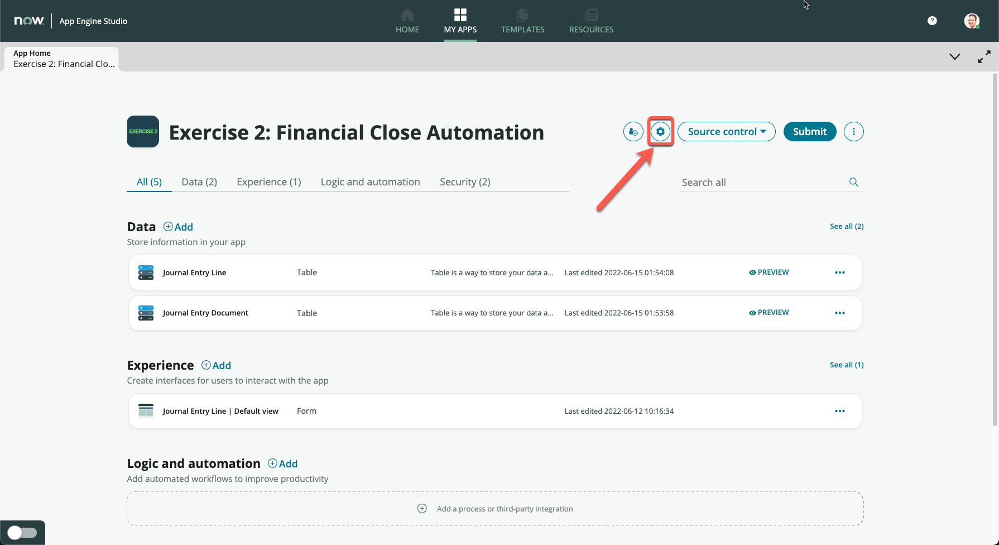

1. Click **Open app in Dev Studio**

    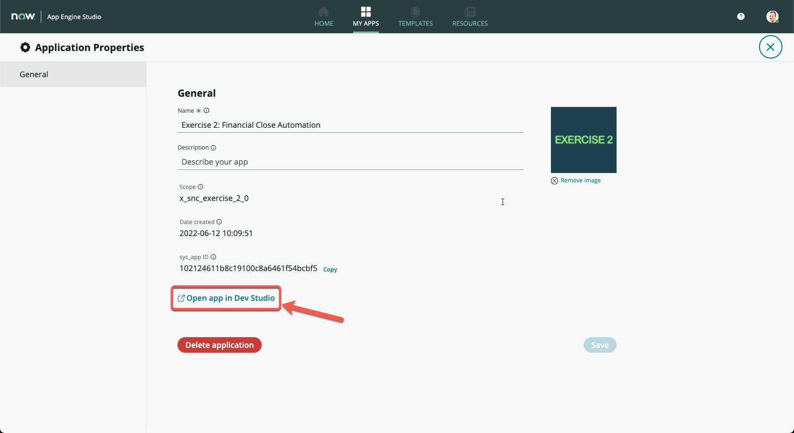

1. A new browser tab will open in *Studio IDE*

1. Click **Create Application File** on the top left

1. Search **Variable Set**, then click the **Create** button on the bottom right

    

1. Click **Multi-Row Variable Set**

    

1. On the **Variable Set** form, fill in the Title as **Journal Entry**, then click out of the field. The **Internal name** should be automatically populated as **journal_entry**. Leave it as such.

1. Click **Submit**

    

1. On the left panel, scroll down until you see **Service Catalog > Variable Sets > Journal Entry**

1. Click on **Journal Entry**

1. On the Variable Set, you should now see more related lists below. 

    > **NOTE:** It is important you follow the next few steps accurately, if not there might be some problems in the later part of this lab.

1. Under **Variables**, click **New**

1. On the new **Variable** screen, enter **100** under *Order*

1. Under the **Question** tab, enter **GL Account** under *Question*

    

1. Click **Submit**

1. Create 3 more variables under the **Journal Entry** Variable Set (Repeat steps 12 to 14)

    Order | Question | Name (autofilled)
    ------------ | ------------- | -------------
    200 | Cost center | cost_center
    300 | Debit | debit
    400 | Credit | credit

1. Your Variable Set should now look like this

   

> If you cannot see the new Variables, click the related list filter condition to refresh the list.

   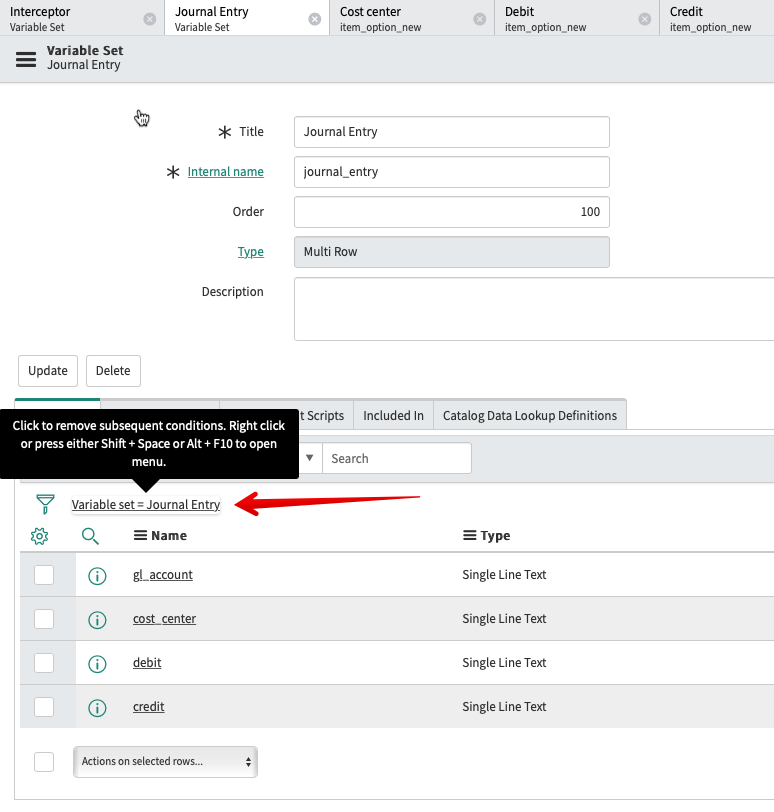

### Creating a Record Producer

Now that we have the variable set to capture Journal Entry Lines, let's use this in a new Record Producer

> We will do this section in ServiceNow Studio IDE for quicker access, but you could definitely use catalog builder as well.

1. Click **Create Application File**, then search for and create **Record Producer**

1. In the **Record Producer** screen, fill in the form as follows

    Field | Entry
    ------------ | -------------
    Name | Post Journal Entry
    Table name | Journal Entry Document
    Script (Scroll down) | Copy and paste the script below (Overwrite default script)

    ```
    (function() {

	var mrvs = producer.journal_entry;

	var l = mrvs.getRowCount();
	for(var i = 0; i < l; i++) {
		var row = mrvs.getRow(i);
		var cells = row.getCells();

		var journaldocument = new GlideRecord('x_snc_exercise_2_0_journal_entry_line');
		journaldocument.initialize();
		journaldocument.setValue('journal_entry_document', current.getUniqueValue());
		journaldocument.setValue('gl_account', cells[0]);
		journaldocument.setValue('cost_center', cells[1]);
                journaldocument.setValue('debit', cells[2]);
                journaldocument.setValue('credit', cells[3]);
		journaldocument.insert();
	}

    })();
    ```

3. Right click on the form header and click **Save**

    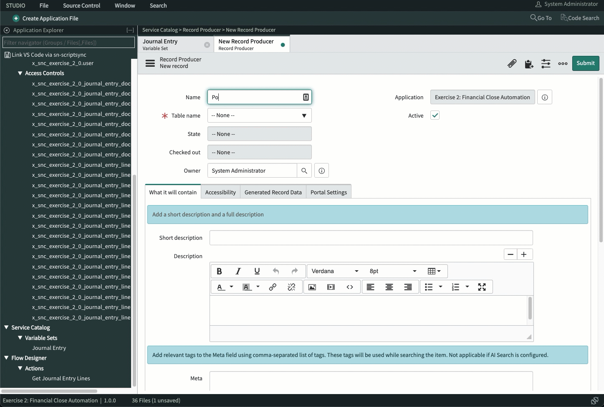

1. Scroll down to the **Variables** tab and click **New**

1. Fill in the form as follows

    Field | Entry
    ------------ | -------------
    Map to field | **Checked**
    Order | 100
    Field | Company code
    Question | Company code    

    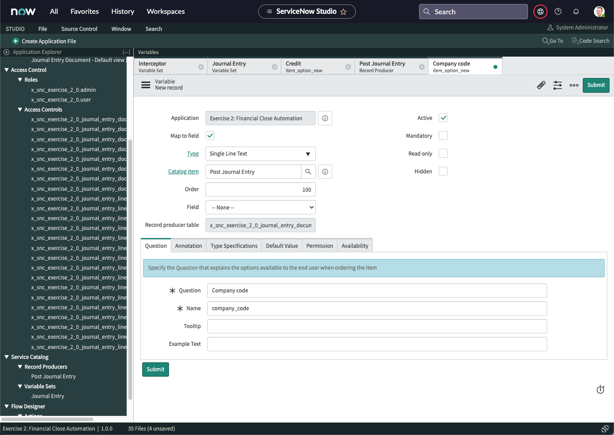

    > We will only work on this one variable for the sake of time, but you could fill out the rest of the fields if you feel necessary. (*Fiscal year, Posting date*)

1. Click **Submit**

1. Navigate back to the **Post Journal Entry** Record Producer tab

1. Click the **Variable Sets** tab

1. Click **Edit...**

1. On the **Edit Members** screen, move **Journal Entry** to the right column, then click **Save**

    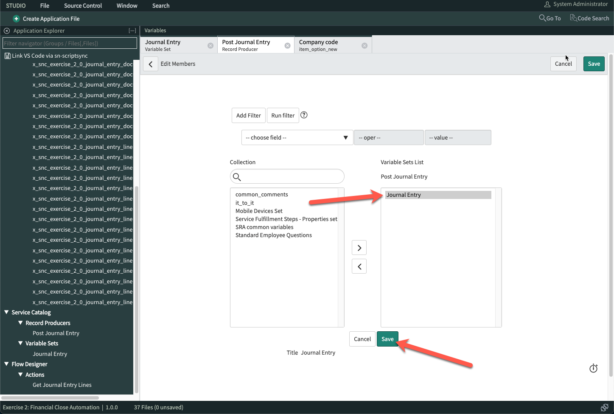

1. Back on the Record Producer screen, click the **Accessibility** tab, 

1. Next to **Catalog**, click on the **Lock** icon

1. Where it says *Select target record*, search and add **Service Catalog**

1. Under category, search and select **Can We Help You?**

    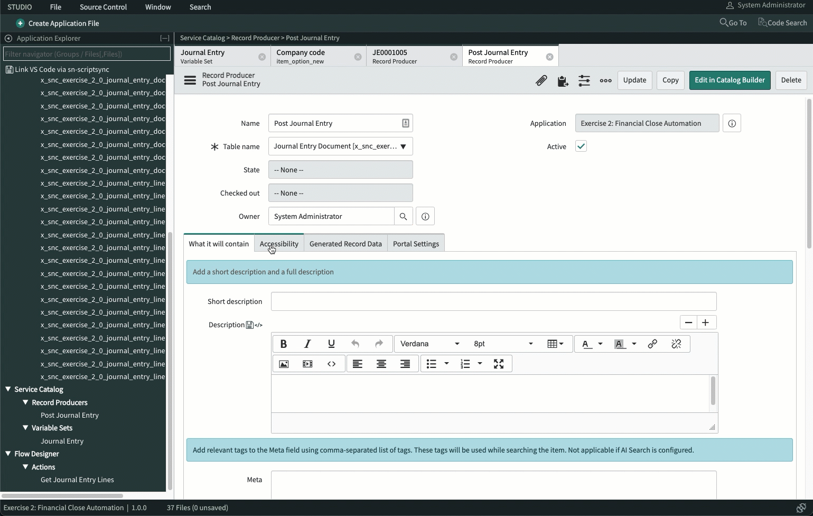

1. Right click the form header and click **Save**

1. We can now test our Record Producer. Click **Try It**

    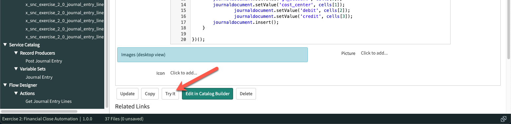

1. For *Company Code*, enter **1002**

1. Click **Add**

1. On the pop-up modal, enter the following details

    Field | Entry
    ------------ | -------------
    GL Account | 622210
    Cost center | 10001000
    Debit | 8000
    Credit | 0 

    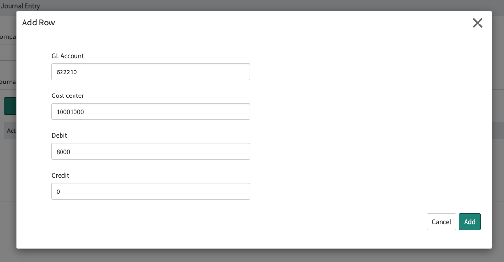

1. Click **Add**

1. Click **Add** once again for a new Journal Entry

1. This time, enter these details

    Field | Entry
    ------------ | -------------
    GL Account | **622250**
    Cost center | 10001000
    Debit | 0
    Credit | 8000

1. Click **Add**

1. Your screen should now look like the following

    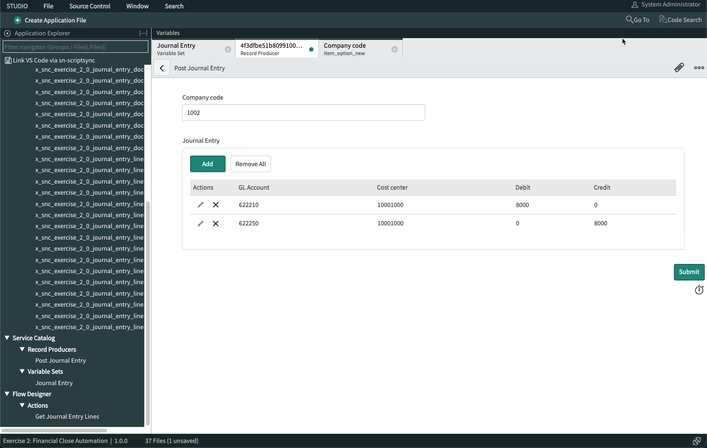

1. Click **Submit**

1. Your screen should now show the submitted record. Ensure that the *Company code* is captured, and you have the two Journal Entry Lines under the related table

    

Congratulations! You have now built the front end user experience to capture Journal Entries, and this record producer can be added to any catalog on any portal. It can even be used on the mobile app. Obviously, this is only one approach, and in reality, some of our customers still prefer to have everything entered via an excel template, which is uploaded against the record producer/catalog item before being processed through an import set.

I personally prefer the MVRS approach as there is little room for error. You can also build validation logic in directly via a client script or business rule.

## Integrating to SAP

Now that we can capture this data, let's close off the process by building the integration to SAP

1. Navigate back to the App Engine Studio interface, if you have closed it before, open the **Exercise 2: Financial Close Automation** app

1. Under *Logic and automation*, click **Add**

1. Click **Flow**

1. Click **Build from scratch**

1. Under *Name*, enter **Post Journal Entry to SAP**

1. Click **Continue**

1. Click **Edit this flow**

1. Click **Add a trigger**

1. Under **Record**, select **Created**

1. Under **Table**, search and select **Journal Entry Document**

    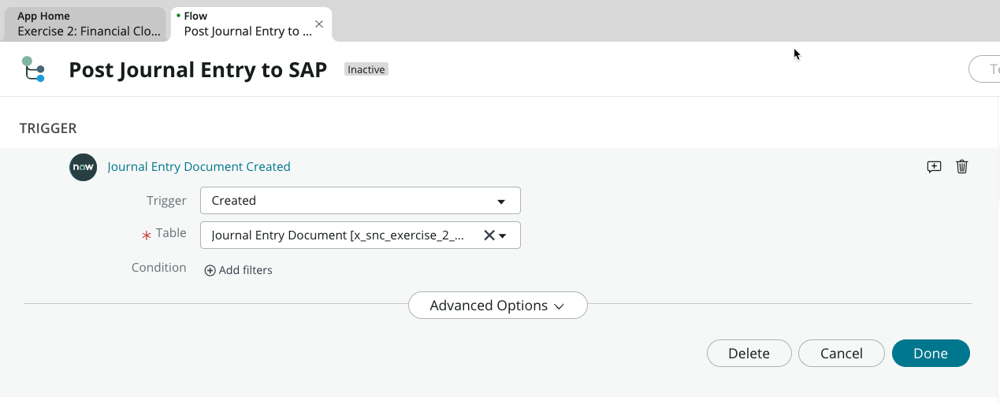

1. Click **Done**

1. Under **Actions**, click **Add an Action, Flow Logic, or Subflow**

1. Click **Action**

1. Search for **sap erp**, then select **Post Journal Entry**

    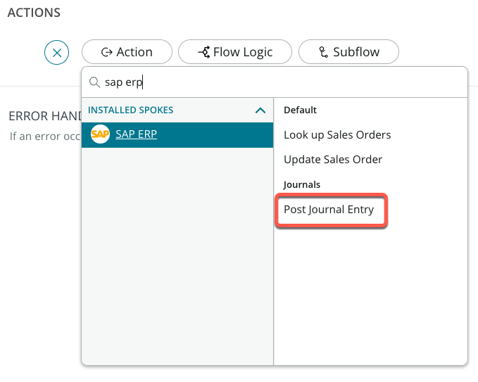

1. Map the data pills for each of **1. Company code, 2. Fiscal year** and **3. Posting date** from the **Trigger - Record Created** step Record to the corresponding fields in the action

    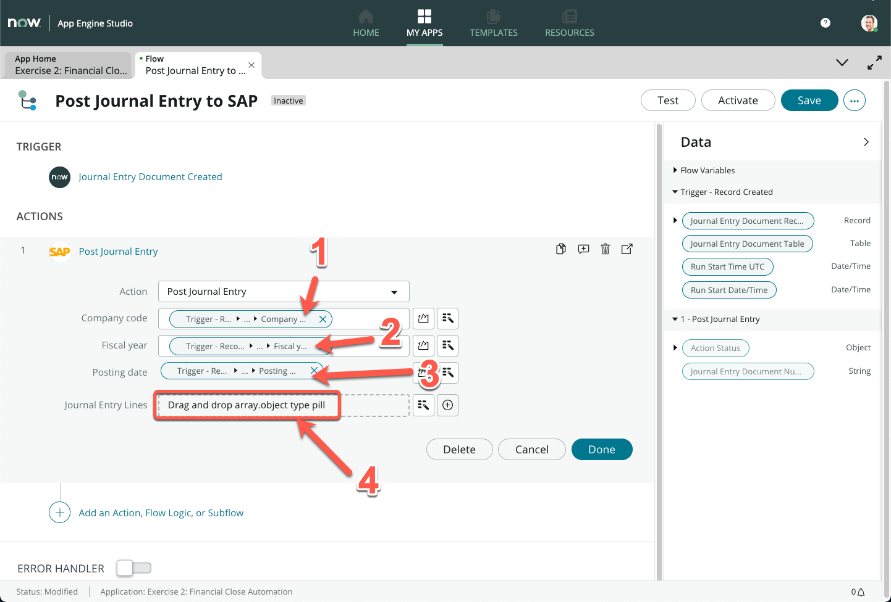

1. However, notice that for the **Journal Entry Lines** field, it only accepts **array.object** type pills. Recall how we structured our table earlier, there are multiple Journal Entry Lines against one Journal Entry Document. What we need to do here is get all the Journal Entry Lines linked to this trigger record.

1. Fortunately, the action to convert a list of records into an array object has already been configured for you.

1. Click **Add an Action, Flow Logic, or Subflow**

1. Click **Action**

1. Search **Get Journal Entry Lines**, and select the one action under the Exercise 2 spoke

1. On the right of the action, open the Action by clicking on the **Open Action in Action Designer icon**

1. Work through the different action steps here to understand what is being done

    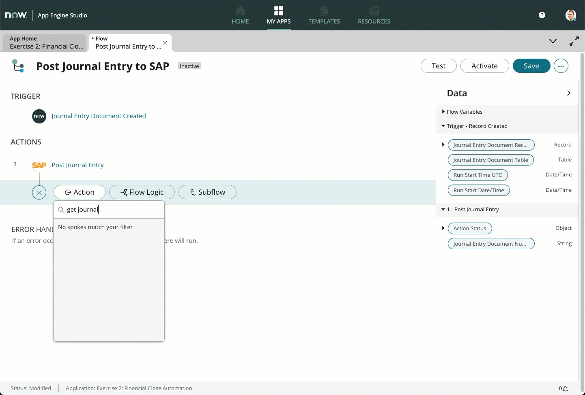

    > This action takes the input of the Journal Entry Document, then finds all related Journal Entry Lines associated with the Journal Entry Document and converts each record to an Array.Object

1. Navigate back to the Flow

1. Drag the **Journal Entry Document Record** data pill onto the **Journal Entry Document** field under *Get Journal Entry Lines*

1. Move this action before the **Post Journal Entry** action so that we have access to the **Journal Entry Lines Array.Object** to pass into the **Post Journal Entry** action

1. Click the **Post Journal Entry** action

1. Drag the **Journal Entry Lines Array.Object** onto **Journal Entry Lines**

    

1. Click **Done**

1. Click **Add an Action, Flow Logic, or Subflow**

1. Click **Action**, then under **ServiceNow Core**, search and select the **Update Record** action

1. For *Record*, drag in the **Journal Entry Document Record** data pill

1. Click **Add field value**

1. Select **Document number**, and under *2 - Post Journal Entry*, drag in the **Journal Entry Document Number** data pill

    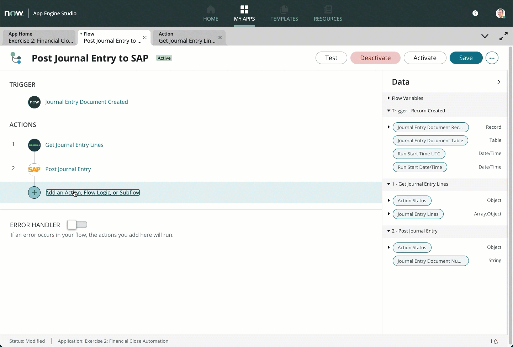

1. Click **Activate** on the top right of the screen

    > **What are we missing here?**<br>
    Once again we are skipping the approvals that has to happen before a Journal Entry actually gets posted into SAP in the interest of time. There are also often many validation rules for different Journal Entry types (Intercompany Posting, Asset Depreciation Posting, etc.) that we are not configuring in this exercise. Here is a common workflow that you will see across this Journal Entry posting process: <br>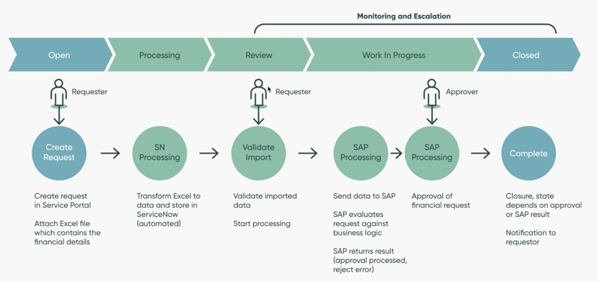 <br> The method used (Excel template) is slightly different but the overall approach is the same.

## Testing the experience and flow

1. Navigate back to the ServiceNow Polaris UI, and search for **Service Portal** under *All*

1. Click **Service Portal Home**, and it will open in a new browser tab

    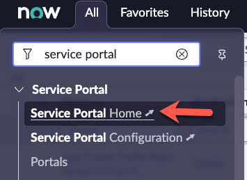

1. Under the search bar, enter **post journal entry**, then hit search

1. Click **Post Journal Entry**

    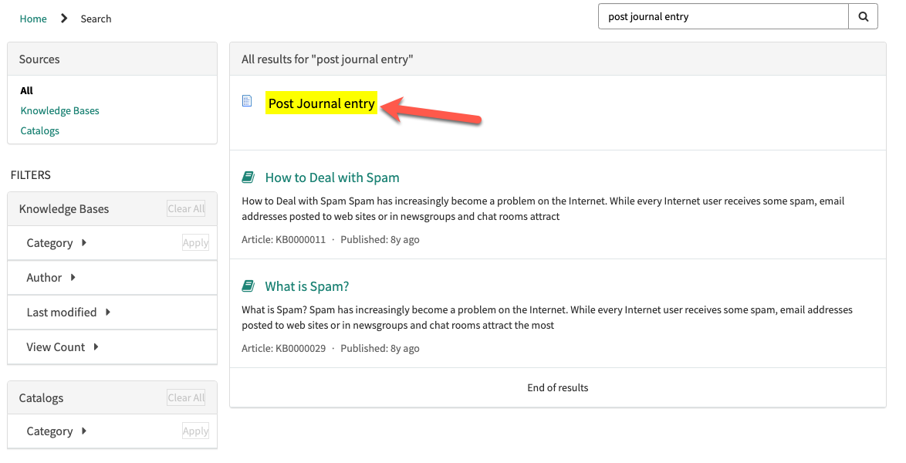

1. This was the record producer you created earlier.

1. Enter **1003** for Company code

1. Click **Add**, then enter the following

    Field | Entry
    ------------ | -------------
    GL Account | 622210
    Cost center | 10001000
    Debit | 8000
    Credit | 0 

    

1. Click **Add**

1. Click **Add** once again for a new Journal Entry

1. This time, enter these details

    Field | Entry
    ------------ | -------------
    GL Account | **622250**
    Cost center | 10001000
    Debit | 0
    Credit | 8000

    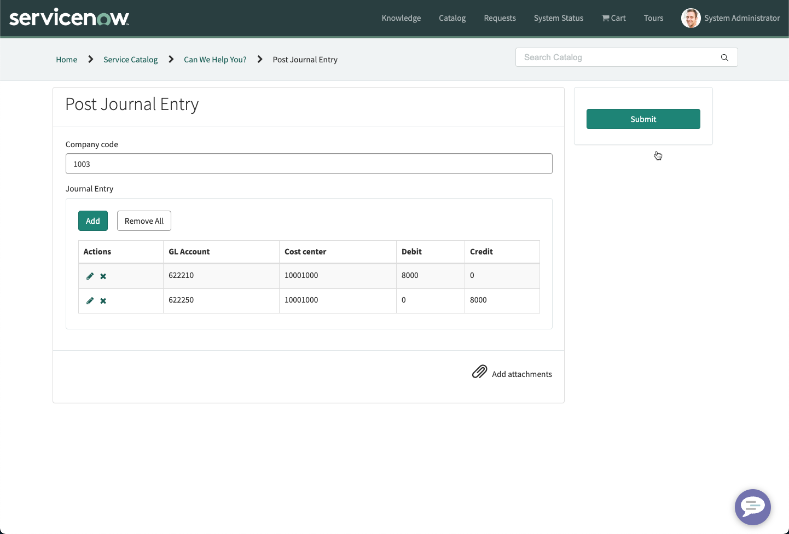

1. Click **Submit**

1. Go back to App Engine Studio, with the **Post Journal Entry to SAP** flow open

1. On the top right, click on **more** then click **Executions**

    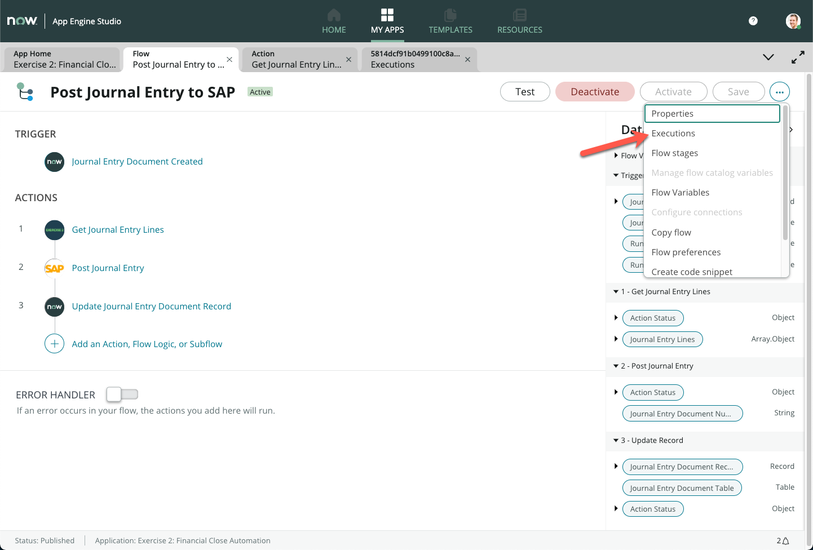

1. You should now see one execution record, click it

    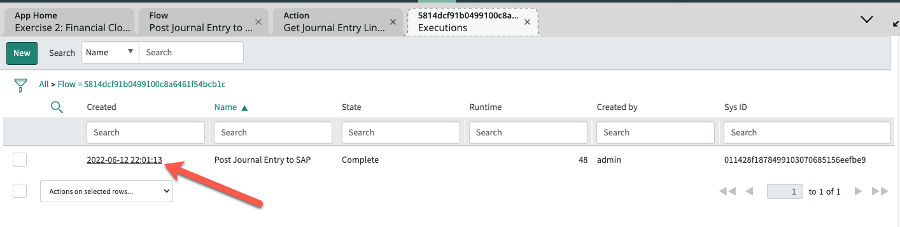

1. Confirm that the workflow was executed successfully, then click the **Update Record** action to expand it

1. Click the **Record** number, and confirm that the **Document number** field is now populated

1. This is the document number you can use to identify the Journal Entry Document in SAP

    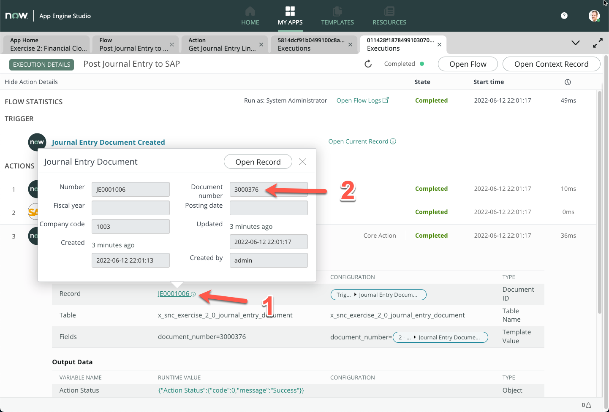

1. For your reference, the Journal Entry Document will show up as such in SAP

    

## Summary


Congratulations on completing this lab! You've built 2 apps that will help Modernize SAP. One for automating approvals on any object from SAP, and another for assisting in the Financial Close process by giving users a better experience when posting Journal Entries. Just these alone will tremendously alleviate a great amount of manual effort that was previously done through SAP + multiple channels.

There are obviously so many more areas Creator Workflows can help, from P2P to OTC. Shifting customizations out of SAP is the number 1 priority for many customers. ServiceNow Creator Workflows allows you to do that all on our industry leading Low-code Application Development Platform.