# SAP Modernization Lab

## Goal

In this lab, you will learn how ServiceNow Creator Workflows can help you to modernize ERP processes with the tools and functionalities available on the ServiceNow platform.

## Background

A business process refers to a set of activities that have to be performed to complete an end-to-end business scenario. There are multiple business processes in ERPs, the most common ones are listed below:

Name | What is it?
------------ | -------------
Order to Cash | Order to cash (OTC or O2C) is a set of business processes that involve receiving and fulfilling customer requests
Procure to Pay | Procure to pay (PTP or P2P) is the process of requisitioning, purchasing, receiving, paying for, and accounting for goods and services, covering the entire process from point of order right through to payment.
Hire to Retire | Hire to retire (H2R) is a human resources process that includes everything that needs to be done over the course of an employee's career with a company.
Plan to Produce | Plan-to-Produce (Pl2P) encompasses an end-to-end perspective on producing goods. It depicts the shop-floor procedures and focuses on the integration of surrounding aspects into production processes.
Plan to Inventory | Plan to Inventory (P2I) the process of determining the optimal quantity and timing of inventory for the purpose of aligning it with sales and production capacity.
Quote to Cash | Quote-to-cash (QTC) process encompasses many sales, account management, order fulfillment, billing, and accounts receivables functions.
Record to Report | Record to report (R2R) is a finance and accounting management process that involves collecting, processing and presenting accurate financial data.

Often times, there are multiple exceptions outside of an expected business process flow (sometimes refered to as a "Happy Flow") that organizations need to account for - either by customizing the ERP, or relying on manual processes that sit outside of the ERP. 

Then, there is also the issue of data availability. There is a learning curve to navigating ERP systems due to the complexity of the business objects, everyday business users might not have access to the right environment and training to use these ERP systems, and need a friendlier way to interact with the data.

ServiceNow Creator Workflows solves these challenges with it's low code capabilities paired with easy to configure integrations to various ERP systems. We will focus on SAP in this lab.

# Exercise 1: Delegation of Authority

## Introduction

When it comes to automating ERP workflows, nothing is more painful, or more time consuming than the approval cycle. Couple that with a rigid system like SAP, and it becomes difficult to track, let alone automate approvals on everyday transactions like Purchase Orders, Sales Orders, Invoices, etc. A common term for this process is Delegation of Authority (DoA), or Approval Matrix.

Within SAP, [there is such a feature](https://help.sap.com/doc/132b1ea8da1d4281a2da23f3cf506809/2.0.06/en-US/07dc534035524965a902c5bd6ffdbc3a.html), but it is limited in capability and does not scale for exceptional workflows.

## Tales from the field

In one of our customer's internal landscape, they reported having 54 different workflows that covers multiple business objects, and their solution to that was over 12,000 lines of code in a custom .NET application for approvals and authority. Some of these workflows require 7 or more levels of approvals, and any changes to personnel or approval logic requires a major rewrite of the code, which they currently spend over 30 days a year doing. Approvers only have one desktop interface they can use to run these approvals. Obviously not scalable, and a terrible user experience! 

> The sample that we will work with, but it usually gets a lot more complicated than this ☠️

Thankfully, we have the solution for this, so let's start by showing how you can run these approval matrices on top of the Sales Order documents from SAP. 
  
For easy reference, this is how the Standard Order (Sales Order) document looks like in SAP ECC. You navigate to this module by entering the T code *VA01*. The T Code (Transaction code) is a 4 digit shortcut key to access a requested transaction, sort of like carrying out an *incident.list* command in the ServiceNow UI.

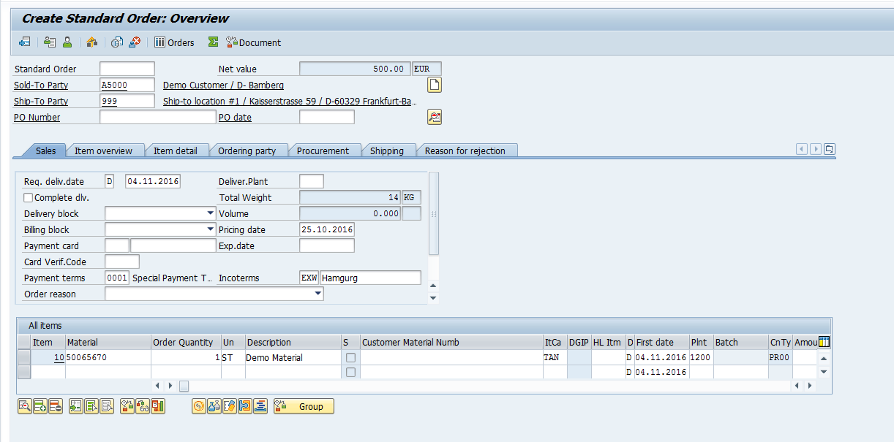

## Let's start

1. Under **All**, search and navigate to **App Engine Studio**

    

1. Click **Create app** on the top right of the screen

    

1. On the Create App page, name the app "Delegation of Authority", and for description, enter "Create an approval matrix for various SAP documents"

    

1. Click **Continue**

1. Leave the default roles - *admin* and *user*, and click **Continue**

1. Click **Go to app dashboard**

## Create a Sales Order table

We will now create a table to store Sales Order document data from SAP.

1. Under **Data**, click **Add**

    

1. Click **Create a table**

1. Click **Get started**

1. On the *Add Data* page, click **Create from scratch**

1. For Table label, enter **SAP Sales Order**. Table name should be auto-populated.

1. Check **Auto number**

1. For Prefix, enter **SAPSO**

    

1. Click **Continue**

1. Allow all access for *admin* and *user*, then click **Continue**

    

1. Close the pop-up dialog

1. You should now be on tha *Table Builder* interface. Click **Add new field**, and add the following fields:

    Column label | Type
    -------------- | --------------
    Document number | String
    Document type | String
    Amount | Decimal 
    Sales organization | String 
    Status | Choice (Dropdown with --None--) : New, Approval triggered, Approved, Rejected, Updated SAP

1. Click **Save**, your screen should look like this, then click **Form views**

    

1. Drag the 3 fields you created from the left panel onto the form. Your screen should look like this:

    

1. Click **Save**

Great, you now have a simple table to store Sales Order data via the SAP integration that we will be configuring next.

## Get Sales Order data via the SAP ERP Spoke

1. Go back to the app home page 

1. Under *Logic and Automation*, click **Add**

1. In the *What do you want to add* screen, click **Flow**

    

1. Click **Build from scratch**

1. Under **Name**, enter "Get Sales Orders from SAP every hour"

1. Click **Continue**

1. Click **Edit this flow** once you see the *Success! Your flow is ready.* screen

1. Close the pop-up box

1. Click **Add trigger**

1. Under the *Date* section, click **Repeat**

1. Change the repeat duration to 2 hours

    

1. Click **Add an Action, Flow Logic, or Subflow**

1. Click **Action**, and you should see a dropdown appear

1. In the *Search* bar, enter **SAP**

    

> You should be able to see a few different SAP spokes show up. There are 2 different integration methods to both SAP ECC (Older version) and SAP S/4 HANA available in ServiceNow's out of the box integrations available in the Enterprise package of Automation Engine. 
   
Let's break down what these mean: 
  
**SAP ECC**: Most of the companies running on SAP are running on SAP ECC. It is the offering for a large enterprise. Companies with large volume, complex business processes and operating in multiple geographies go for SAP ECC. It is built on ABAP stack. 
  
**SAP S/4 HANA**: This is the latest release of SAP ERP and it can run only on HANA database. With this release, SAP has simplified their core database architecture. This together with in-memory processing enables business to do complex business computation within minutes.
  
**Integration via IDoc**: IDOCs or intermediary documents are another way to exchange information to and from SAP. If you are more aware of web technologies, consider IDOCs as XML. It consists of neatly defined data segments with parent and child nodes. There are specific steps to configure inbound and outbound IDOCs.
  
**Integration via RFC**: If you are looking at a real time SAP system integration scenario, RFC is probably the best way to go. In this case, certain functions are enabled for remote call. One such function could be for example sales order creation. Third party applications can integrate with SAP using these RFCs for a real time communication and business process validation (example price computation, minimum order check etc.).

15. Click **SAP ERP**, this is a simulation of the actions available in the other prebuilt spokes.

1. Click **Look up Sales Orders**

    

1. In the action that shows on the screen, have a quick look at what shows up. These are a subset of the filter options available in the OOTB spokes to retrieve a list of Sales Orders. In this exercise, we will only return one Sales Order record for easier accesibility.

    

1. Notice how the **Delivery Block** field is populated with **ServiceNow approval**. Delivery block when applied, blocks the sales order for delivery i.e., delivery cannot be created until the delivery block is removed by the authorized person. This list can be customised in SAP, and the logic would be that as Sales Orders are created in SAP, this Delivery Block status is automatically applied until the approval is completed in ServiceNow.

1. Leave everything as it is, and click **Done**

1. Click **Add an Action, Flow Logic, or Subflow**

1. Under **ServiceNow Core**, click **Create Record**

    

1. On the table field, search and select **SAP Sales Order** (the custom table you created)

1. Click **Add field value**, select **Document number**

1. Drag the **Document number** data pill into the input field

1. Repeat the above 2 steps for **Amount, Document type** and **Sales organization**

    

1. Click **Save** on the top right of the screen.

1. Click **Test**

1. Click **Run Test**

1. Click **Your test has finished running. View the flow execution details.**

    

1. In the new tab that opens, click the **Create Record** action

1. Click the Record, if you followed the guide so far, the record should be **SAPSO0001001**

    

1. In the pop-up box, click **Open Record**, it should open in a new browser tab, ensure that all the fields are populated. (Your output will be different)

    

Congrats! You have built the integration to get Sales Order data from SAP. Go back to the previous browser tab, but don't close anything yet.

## Building the approval matrix using decision builder

For this part of the exercise, we will rebuild this following approval matrix

1. Go back to the **App Home** tab

1. Under *Logic and automation*, click **Add**

1. Click **Decision**

    

1. Click **Get started**

1. Under Name, enter **Sales Order Approval Matrix**

    
> If you face an issue with the Continue button, you might have to close this screen and click Decision again

6. Click **Continue**

1. Click **Edit decision table**

1. Click **Add an input**

1. Under label, enter **Sales order record**

1. Under type, select **Reference**, and under Table, search and select **SAP Sales Order**

    

1. Click **Save** on the top right

1. Click **Add result column**

    

1. Under Result column label, enter **Approval group**

1. Click **Result type**, then select **Reference**

1. Under **Result table**, search **Group** and select **sys_user_group**

1. Click **Done**

1. Under the **Approval group** column, add these selections as per our matrix at the start of this section: Finance managers, Finance controllers, CFO, CFO

    
    
1. Now we have the results, we need to add the conditions.

1. Click **Add condition column**

1. In the pop-up, select the fields as per the image below

    

1. Click **Done**

1. Click on the **Plus sign** in between the 2 columns

    

1. Click **Add condition column**

1. Fill in the pop-up modal as per the image below

    

1. Click **Done**

1. Click on the top left selection box, select **less than**, and Value **5000**

    

1. On the box to the right, select **is**, and Value **Standard sales order**

    

1. See if you can fill in the rest according to the matrix below (You have just completed the first row)

29. Your screen should look like the following once complete

30. Click **Save** on the top right

## Using approval decision matrix in a flow

1. Navigate back to **App Home**

1. Under *Logic and automation*, click **Add**

1. Click **Flow**

1. Click **Build from scratch**

1. Under **Name**, type **Sales Order Approval Flow**, then click **Continue**

1. Click **Edit this flow**

1. Click on **Add a trigger**, and under *Record*, select **Created**

1. Under *Table*, search and select **SAP Sales Order**

    

1. Click **Done**

1. Click **Add an Action, Flow Logic, or Subflow**

1. Click **Flow Logic**, then **Make a decision**

1. Under *Decision Label*, type **SO Approval Matrix**

1. Under **Decision Table*, search for the decision table we just created, **Sales Order Approval Matrix**

1. Drag in the **SAP Sales Order Record** data pill onto **Sales order record**

    

1. Click **Done**

1. You should now see three branches appear for each *Group* we selected as approvers earlier

> **IMPORTANT** For this lab, we will not spend time building out the approval workflow for each branch. The idea here is that you now have the ability to cater to any speicifc workflow approval pattern using the ServiceNow Core *Ask for Approval* action.

17. Now that you understand we will skip the approval building workflow, click on **+** under the first branch

1. Click **Action**

1. Search for **SAP ERP**, then select **Update Sales Order**

    

20. Under the **Sales Document** field, drag the **Document number** pill onto the field

21. Change the **Delivery Block** field to **None**

    

1. Click **Done**

> For reference, this action will remove the delivery block as you see in the image from SAP ECC below, which will allow the order to move to the next stage, which is generally creating a delivery document. 
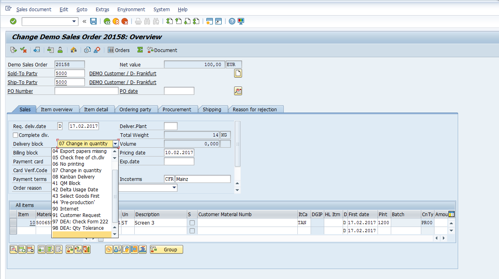

23. On the **Update Sales Order** action you just added, click on the **Duplicate** icon twice

1. Drag each of the 2 duplicated actions under each of the other branches

    

1. Click **Save**

1. Click **Activate**

1. Click **Test**, and select the record that was created via the first flow we created, it should be **SAPSO0001001**

    

1. Click **Your test has finished running. View the flow execution details**

1. Check the execution flow, did it match our Approval Matrix? Your results will vary based on your record.

    

1. If it did not, examine your Decision Builder table again to see if there was anything you missed.

As you can imagine, now that we have these 2 workflows designed, one will essentially trigger off the other: Our custom app will pull Sales Orders from SAP every 2 hours, and for any new Sales Orders picked up, it will be processed via our Decision Table, before routing to the right parties for Approval. Only after approval, will we then update the same Sales Order back in SAP (to remove the delivery block).

Well done! You've come to the end of Exercise 1, where you've built a very powerful approval matrix alternative that sits on top of any SAP document to drive the Delegation of Authority process. Of course, this is only the very start, and you can start to include platform capabilties such as SLAs, Approval Delegation periods, Conversational integrations, Mobile Approvals and more that makes the entire process seamless.

# Exercise 2: Automating Financial Close - The Journal Entry experience

## Introduction

The financial close is a critical process that happens regularly (Monthly, Quarterly, Yearly) in a business with the general goal of producing financial reports representative of the company's true financial position. This is a stressful exercise and there is typically a checklist of activities that the finance team has to undertake, for example: Perform inventory count, reoncile account and post Journal Entries, update cash flow statements, balance petty cash funds, any many more.

Many of these activities also tie back to SAP as the system of record, but this is essentially is a workflow activity, not a record centric one! Navigating across SAP, updating, checking then reporting then becomes a huge headache. In fact, in a 2021 SAPinsider report, 58% of organizations see financial close as the biggest pain point for financial processing, and only 30% of organizations have implemented solutions to automate the SAP financial close process, far below areas such as Account Receivable or Accounts Payable. So can we make this better? Obviously!

In this exercise, let's focus on one of the key activites, which is Journal Entry posting from ServiceNow to SAP.

> A journal entry is used to record a business transaction in the accounting records of a business. A journal entry is usually recorded in the general ledger; which is then used to create financial statements for the business.The logic behind a journal entry is to record every business transaction in at least two places (known as double entry accounting).   In the following diagram, you can se that posting journal entries in the general ledger is among the first tasks in the financial close process. Not on finance users, but sometimes business users as well have to post hundreds or thousand of manual journal entries in each period!  
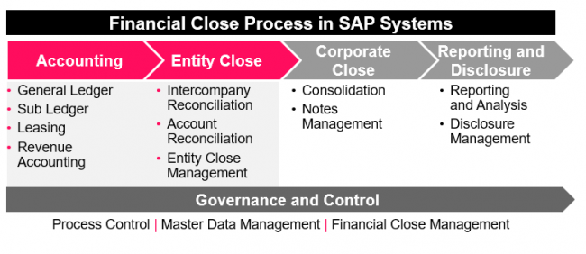

Since you've already gone through the excercise of creating a new app and tables and forms, the setup of these application files for this exercise is already done for you.

1. Navigate back to *App Engine Studio Home* by clicking on the **Home** icon

1. Under *My recent apps*, look for **Exercise 2: Financial Close ...**. If not found, click on **See all of my apps**, then search for **Exercise 2**

    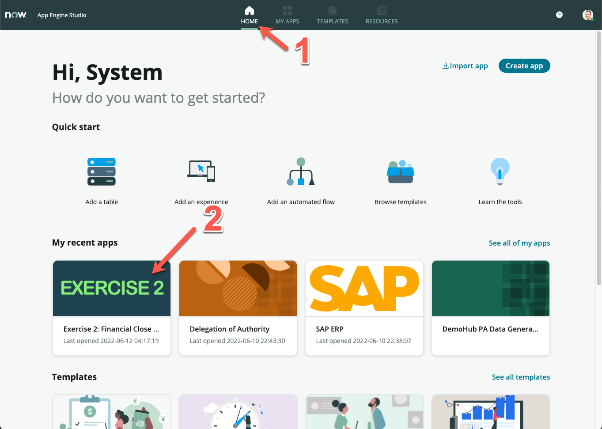

1. Under *Data*, you can see 2 tables added in this application: **Journal Entry Document** and **Journal Entry Lines**

1. First, let's see what a Journal Entry Document looks like in SAP

    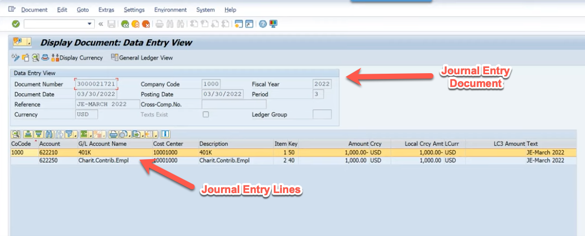

1. Now let's see how this works with our two related tables. Similar? You could have built this in App Engine Studio in less than 10 minutes ;)

    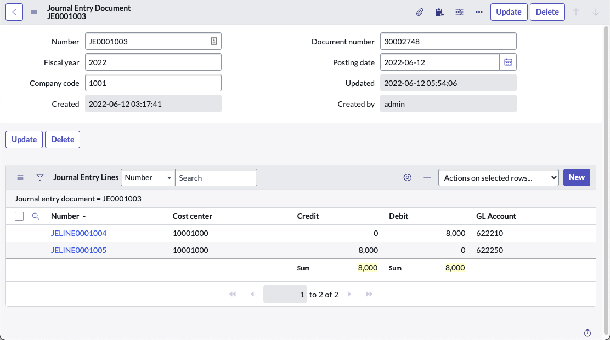

## Building the user experience layer

For this part of the exercise, we will get our hands a little dirtier in building the Record Producer for a user to enter the Journal Entry record. As we now need to enable the user to attach a dynamic number of Journal Entry Lines against a parent Journal Entry Document, there is some scripting needed as part of implementing this feature via a Multi-row Variable Set.

>**What is a Multi-row Variable Set (MVRS)?**  
From ServiceNow documentation: Use a multi-row variable set (MRVS) to capture variable data in a grid layout while submitting a catalog item request for a group of entities. For example, for HR during the reorganization of employees, a single record producer should be able to capture the relevant information such as the department and manager for a group of employees

First, let's create the variable set. This time, for this part, we will be working within studio IDE, but don't close your App Engine Studio interface just yet.

1. In a new tab, go back to the main ServiceNow Polaris UI, and search for **Studio** under *All*, and click on it
   
    

1. Studio should open in a new browser tab, and on the modal on screen, your should be able to see **Exercise 2: Financial Close Automation** on the list, click on it

    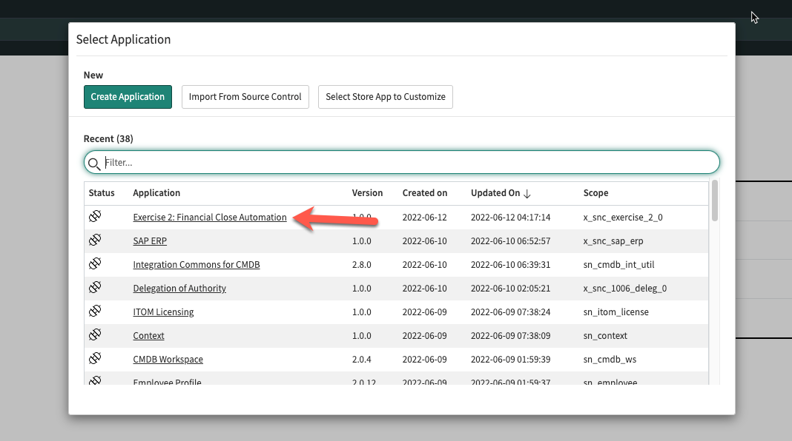

1. Click **Create Application File** on the top left

1. Search **Variable Set**, then click the **Create** button on the bottom right

    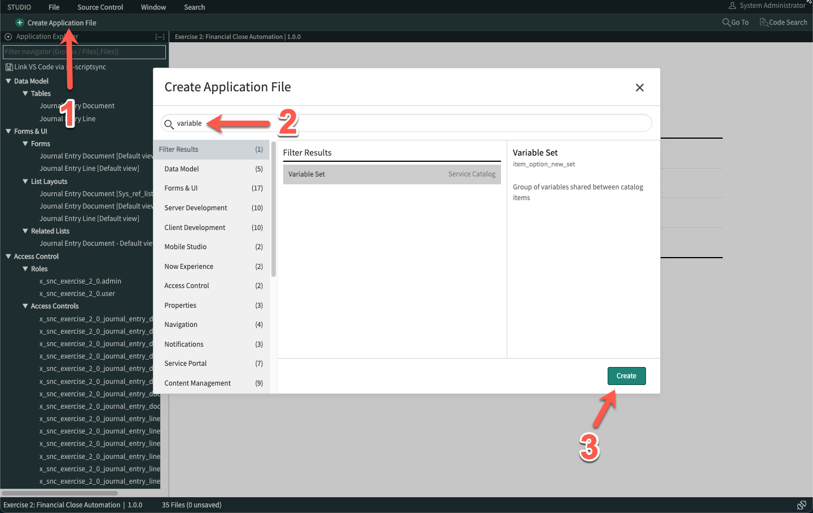

1. Click **Multi-Row Variable Set**

    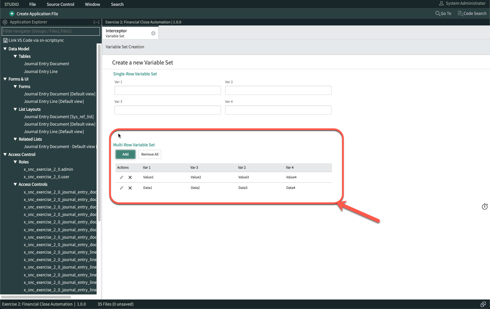

1. On the **Variable Set** form, fill in the Title as **Journal Entry**, then click out of the field. The **Internal name** should be automatically populated as **journal_entry**. Leave it as such.

1. Click **Submit**

    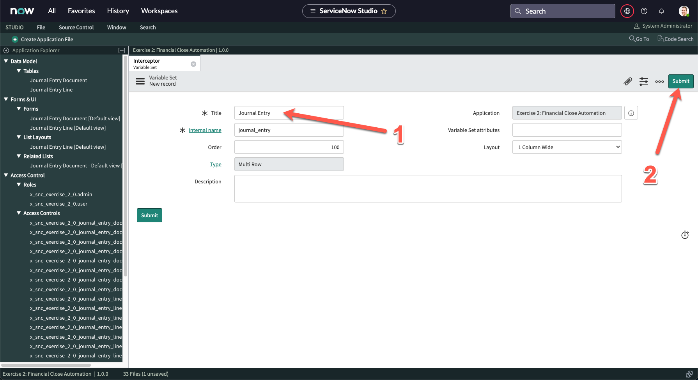

1. On the left panel, scroll down until you see **Service Catalog > Variable Sets > Journal Entry**

1. Click on **Journal Entry**

1. On the Variable Set, you should now see more related lists below. 

1. Under **Variables**, click **New**

1. On the new **Variable** screen, enter **100** under *Order*

1. Under the **Question** tab, enter **GL Account** under *Question*

    

1. Click **Submit**

1. Create 3 more variables under the **Journal Entry** Variable Set

    Order | Question
    ------------ | -------------
    200 | Cost center
    300 | Debit
    400 | Credit

1. Your Variable Set should now look like this

    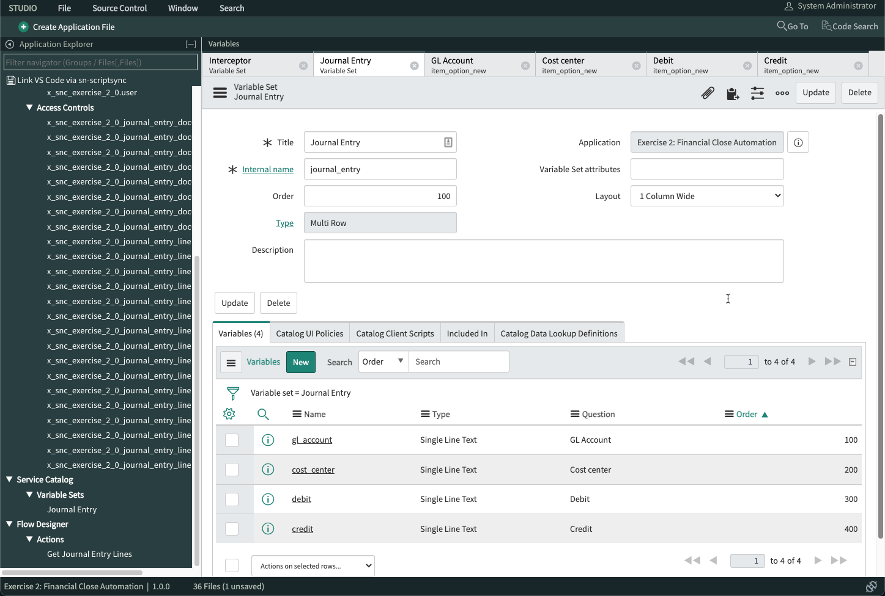

1. 